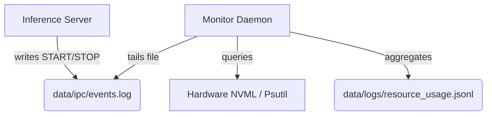

# Inference Resource Monitor  
### Request-Level Telemetry for AI Inference Workloads

A lightweight, out-of-band telemetry daemon designed to attribute CPU, RAM, and VRAM usage to individual inference requests — even under concurrent execution.

Traditional monitoring tools answer:
> “What is the GPU usage right now?”

This tool answers:
> “How much GPU did *this specific request* consume?”

Designed for local inference systems, batching environments, and multi-request workloads.

---

## Why This Exists

Standard APM and system monitors provide only aggregate metrics:

- GPU utilization at 100%
- RAM usage spikes
- CPU saturation

But they cannot attribute resource consumption to individual inference requests.

In high-concurrency environments (batched inference, API servers, streaming models), resource usage overlaps. Naively sampling metrics leads to:

- Double-counting VRAM
- Misleading averages
- No per-request accountability
- Poor capacity planning decisions

This project introduces request-level telemetry with fair-share allocation.

---

## Design Goals

- **Zero Inference Overhead** — Monitoring must never block model execution
- **Request-Level Attribution** — Attribute resource cost to individual requests
- **Concurrency-Aware Math** — Avoid double-counting during overlapping workloads
- **High-Frequency Sampling** — Direct hardware polling
- **Cross-Platform Compatibility** — Windows and Linux support
- **Decoupled Architecture** — No tight integration with model runtime

---

## Core Features

- File-based IPC producer-consumer architecture
- Direct NVIDIA driver access via `pynvml`
- CPU and RAM polling via `psutil`
- Fair-share resource allocation during concurrency
- Structured JSONL output for downstream analytics
- Demo workload simulator included

---

## Architecture Overview

The system is fully decoupled from inference execution.

### Producer (Inference Application)

- Emits lightweight `start` and `stop` events
- Writes events to a shared IPC log file

### Consumer (Monitor Daemon)

- Tails the IPC file
- Polls hardware at high frequency
- Tracks overlapping request windows
- Computes fair-share attribution
- Writes structured metrics to JSONL output

---

### Architecture Diagram



---

## Fair-Share Concurrency Model

When multiple requests overlap in time:

- Hardware is polled at fixed intervals
- Each sample is divided by the number of active requests at that moment
- Each request accumulates only its proportional share

Example:

If 2 requests overlap while 10GB VRAM is allocated:

- Each request is attributed ~5GB for that sampling window
- Prevents inflated totals and double-counting

This enables accurate per-request resource accounting.

---

## Tech Stack

- **Language:** Python 3.8+
- **GPU Telemetry:** pynvml (Direct NVIDIA driver access)
- **System Metrics:** psutil
- **Data Format:** JSONL
- **IPC Mechanism:** File-based event log

---

## Project Structure

```
inference-resource-monitor/
├── src/
│   ├── monitor.py          # Core daemon logic
│   ├── sampler.py          # Hardware polling layer
│   ├── aggregator.py       # Fair-share computation engine
│   └── models.py           # Data structures
├── data/
│   ├── ipc/
│   │   └── events.log
│   └── logs/
│       └── resource_usage.jsonl
├── run_demo.py             # End-to-end workload simulation
└── requirements.txt
```

---

## Installation

### Requirements

- Python 3.8+
- NVIDIA GPU (required for VRAM metrics)
- Windows or Linux

Clone the repository:

```bash
git clone https://github.com/yourusername/inference-resource-monitor.git
cd inference-resource-monitor
```

Install dependencies:

```bash
pip install -r requirements.txt
```

---

## Quick Start (Demo Simulation)

An included demo simulates heavy CPU and memory workloads to demonstrate monitoring behavior.

Run:

```bash
python run_demo.py
```

The script will:

1. Start the monitor daemon
2. Execute 5 simulated inference requests
3. Shut down the daemon
4. Output collected telemetry results

---

## Real-World Integration Example

### Step 1 — Start the Monitor Daemon

```bash
python -c "from src.monitor import ResourceMonitor; ResourceMonitor('data/ipc/events.log', 'data/logs/resource_usage.jsonl').start_optimized()"
```

---

### Step 2 — Instrument Your Inference Code

```python
import uuid
import time
import json
from your_llama_wrapper import LlamaModel

def generate_text(prompt):
    req_id = f"llm_{uuid.uuid4().hex[:8]}"

    # Emit START signal
    with open("data/ipc/events.log", "a") as f:
        f.write(json.dumps({
            "event": "start",
            "request_id": req_id,
            "timestamp": time.time()
        }) + "\n")

    response = LlamaModel.predict(prompt)

    # Emit STOP signal
    with open("data/ipc/events.log", "a") as f:
        f.write(json.dumps({
            "event": "stop",
            "request_id": req_id,
            "timestamp": time.time()
        }) + "\n")

    return response
```

---

## Output Data Schema

Each line in `data/logs/resource_usage.jsonl` represents a completed request:

```json
{
  "request_id": "req_27e759",
  "duration_sec": 3.75,
  "sample_count": 19,
  "cpu_avg_pct": 9.04,
  "cpu_max_pct": 20.8,
  "ram_avg_gb": 9.79,
  "ram_max_gb": 12.86,
  "vram_avg_gb": 0.53,
  "vram_max_gb": 0.73,
  "gpu_util_avg_pct": 16.03
}
```

---

## Metric Definitions

- `duration_sec` — Total time between first and last sample
- `sample_count` — Number of hardware polls during request lifetime
- `*_avg_*` — Fair-share average across active concurrency windows
- `*_max_*` — Maximum observed spike during request window

Useful for:

- Identifying CPU preprocessing bottlenecks
- Detecting VRAM spikes
- Capacity planning
- Cost attribution in shared GPU environments

---

## Limitations

- Requires NVIDIA GPU for VRAM metrics
- Single-node design (no distributed aggregation)
- File-based IPC (not optimized for multi-host clustering)
- No long-term storage or visualization layer included

---

## What This Project Demonstrates

- Producer-consumer architecture design
- IPC-based decoupled system design
- Hardware-level telemetry integration
- Concurrency-aware resource accounting
- Sampling theory applied to systems monitoring
- Request-level observability engineering

---

## Project Status

- Feature complete
- Stable for local inference monitoring
- No active feature development planned

This project focuses on systems telemetry, concurrency modeling, and inference workload observability.
